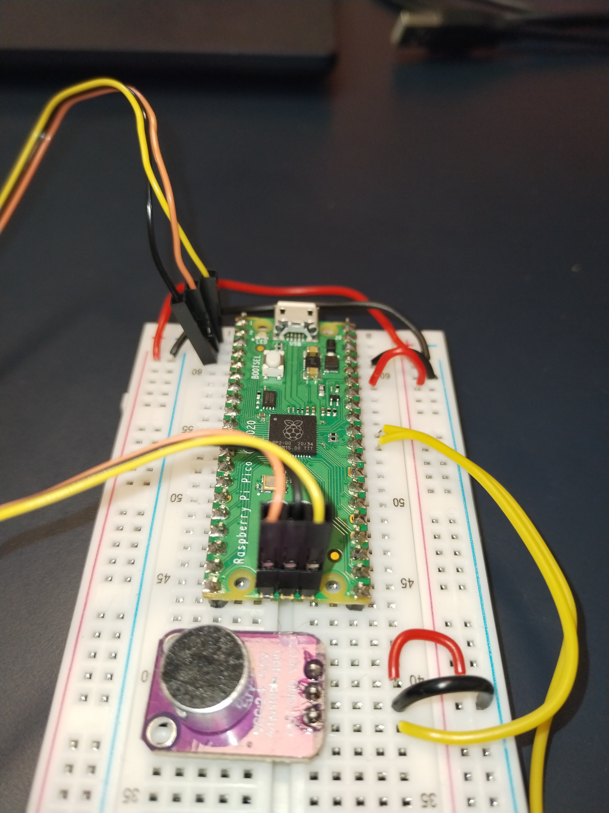
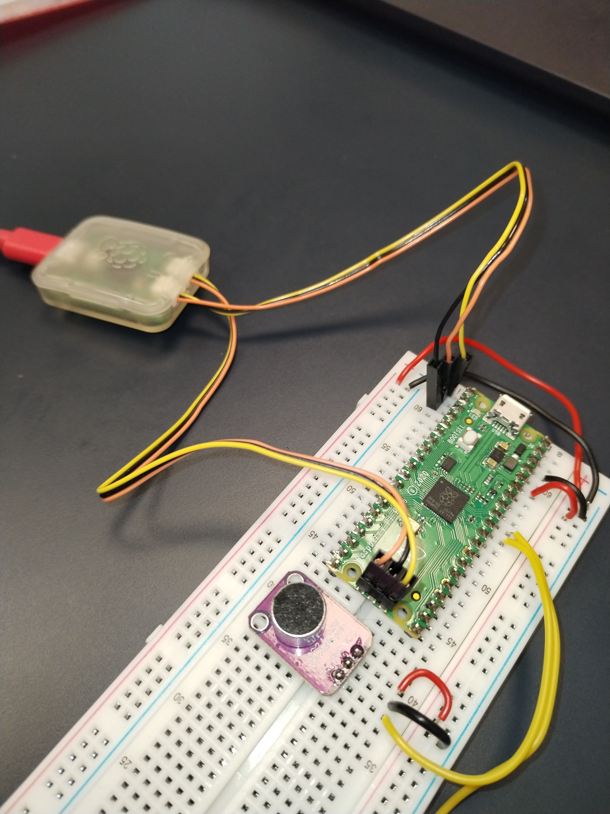

# pico-binaural-lab
This repo is to test a large amount of new possibilities like programming Raspberry Pi PICO with the official SDK and making experiments about binaural localization

## why ?

Years ago, between 2002 and 2006, I used to program 8-bit and 16-bit microcontrollers from Microchip, working with the official IDE and various compilers. I learned by diving into the datasheets, looking up the right registers, and utilizing the peripherals of different components. Professionally, I moved away from this work until 2014, when I had to catch up and learn new tools like Raspberry Pi, Python, and Arduino. While programming with the Arduino IDE is straightforward, it often feels like you're only using about 10% of the hardware's capabilities, with limited access to peripherals. Recently, I had a project that required an STM microcontroller, and using the STM32Cube IDE was a real pleasure. The new RP2040 microcontroller seemed quite powerful, so I tried programming it with the Arduino IDE and various frameworks. However, I found the experience frustrating due to numerous errors, compatibility issues, and long compilation times. I also couldn’t see the appeal of using Python to program such a capable device. The official RP2040 SDK, available in Visual Studio Code, intrigued me. It seemed closer to the STM32Cube IDE experience, offering deeper insights into the controller’s workings, full access to peripherals, and debugging capabilities. At the same time, I was interested in exploring how to manage vibratory and non-linear control systems using microcontrollers. That’s why I decided to create this repository—to gradually build up a solid foundation of knowledge.

*Il y a plusieurs années, entre 2002 et 2006, je programmais des microcontrôleurs 8 bits et 16 bits de Microchip, en utilisant l'IDE officiel et divers compilateurs. J'ai appris en me plongeant dans les datasheets, cherchant les bons registres et utilisant les périphériques des différents composants. Professionnellement, j'ai délaissé cette activité jusqu'en 2014, où j'ai dû me mettre à jour et apprendre de nouveaux outils comme le Raspberry Pi, Python et Arduino. Programmer avec l'IDE Arduino est simple, mais on a souvent l'impression d'utiliser seulement 10 % des capacités du matériel, avec un accès limité aux périphériques. Récemment, j'ai eu un projet qui nécessitait un microcontrôleur STM, et utiliser l'IDE STM32Cube a été un véritable plaisir. Le nouveau microcontrôleur RP2040 semblait très puissant, alors j'ai essayé de le programmer avec l'IDE Arduino et divers frameworks. Cependant, j'ai trouvé l'expérience frustrante en raison de nombreux bugs, de problèmes de compatibilité, et des temps de compilation très longs. Je ne comprends pas non plus l'intérêt de programmer une machine aussi performante avec Python. Le SDK officiel du RP2040, disponible sur Visual Studio Code, m'a beaucoup intrigué. Il semblait offrir une expérience plus proche de celle de l'IDE STM32Cube, permettant de mieux comprendre le fonctionnement du contrôleur, d'accéder pleinement aux périphériques et d'utiliser le débogueur. En parallèle, je voulais explorer la gestion des systèmes vibratoires et automatiques non linéaires avec des microcontrôleurs. C'est pourquoi j'ai décidé de créer ce dépôt, pour acquérir progressivement une base de connaissances solide.*

## blink

The well-known initial repository for making the LED blink. Here's how to connect the Pico's debugger to a breadboard (remember to plug in the Pico's USB for power).

*Le célèbre premier dépôt pour faire clignoter la LED. Voici comment connecter le débogueur du Pico à une breadboard (n'oubliez pas de brancher l'USB sur le Pico pour l'alimentation).*

## hello world

The recommended first repository for testing the serial port is somewhat unique, as the serial port does not use the PICO's USB port. Be sure to specify this in the CMake file.

*Et le premier dépôt recommandé pour tester le port série est un peu particulier, car le port série n'utilise pas le port USB du PICO. Assurez-vous de le spécifier dans le fichier CMake.*

## microphone_adc

This project is taken from the examples to take the ADC port 0 and print it on serial and a small python program in real time

## microphone_adc_gd

This is the first serious project. The purpose is to acquire the signal from two mikes and compute the cross correlation to deduce from where the sound comes.

## microphone_fft_gd

TBC

