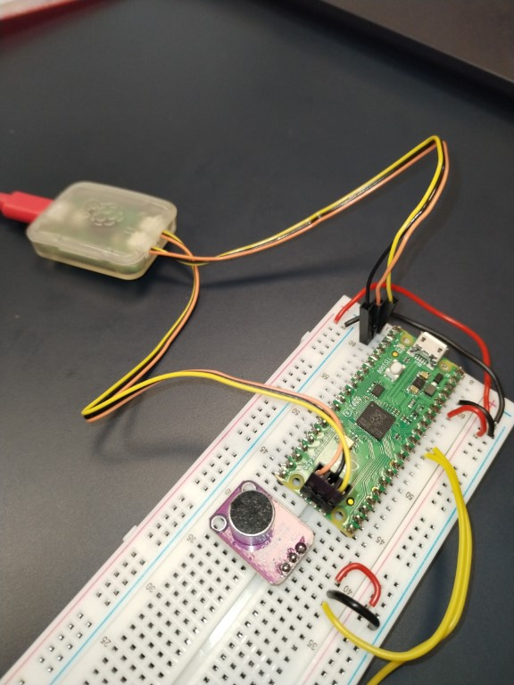

# pico-binaural-lab
This repo is to test a large amount of new possibilities like programming Raspberry Pi PICO with the official SDK and making experiments about binaural localization

## why ?

First of all, a long time ago (2002 to 2006) I was used to program 8bits and 16bits micro-controllers from Microchip using the offical IDE and different kind of compilers. I learnt to program microcontrollers having the datasheet on the knees to find the good registers and using the peripherals of the different components.

Professionnally, I left this activity until 2014 where I had to level-up : Raspberry Pi, Python, Arduino.

But when you program with Arduino IDE, it is simple but you have the impression to use the machine at 10%, no peripherals. For a project, I recently had to use a STM microcontroller and I programmed with STMCube IDE. It was a pleasure.

The new RP2040 microcontroller seemed really powerful. I tried to program it using Arduino IDE and side frameworks but the amount of errors, lack of compatibility and the minutes of compilations were not satisfying. Programming in Python such a machine, I really cannot understand.

The official RP2040 SDK available on Visual Code interested me a lot to approach the STMCude IDE experience, to really understand what the controller does and use all the peripherals, debugger.

On the other side, I wanted to study how to manage vibratory and non-linear automatics with micro-controllers.

I decided to create this repo to get a certain amount of knowledge progressively.

## blink

The famous first repo to make the LED blink.

Here is the way to plug the debugger of a Pico on a breadboard (don't forget to plug the USB on the PICO for power supply)

## hello world

Also the famous first repo to test here the serial port with is a bit special since the serial port is not using the USB port of the PICO. Take care to specify it in the cmake file.

## microphone_adc

This project is taken from the examples to take the ADC port 0 and print it on serial and a small python program in real time

## microphone_adc_gd

This is the first serious project. The purpose is to acquire the signal from two mikes and compute the cross correlation to deduce from where the sound comes.

## microphone_fft_gd

TBC

